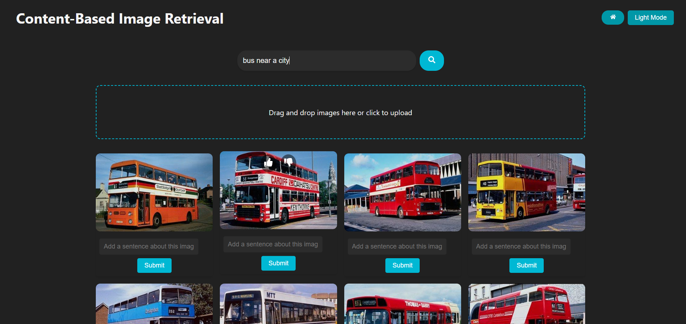

# **Content Based Image Retreival**

# Content-Based Image Retrieval System Utilizing Vision Transformer

[](https://doi.org/10.5281/zenodo.14934936)

This repository contains the code for a Content-Based Image Retrieval (CBIR) system, as described in the research paper "Content-Based Image Retrieval System Utilizing Vision Transformer" by Aniket Mahajan, [Nirmiti Rane](https://github.com/nirmitirane24), and [Pranav Patil](https://github.com/pranavpatil1504).


## Overview

The CBIR system presented here allows users to search for images using natural language queries.  It combines several key techniques:

*   **Vision Transformer (ViT):**  A pre-trained ViT (specifically `google/vit-base-patch16-224` from Hugging Face Transformers) is used for feature extraction, capturing fine-grained image details.  A quadtree-based approach divides images into quadrants for more granular feature extraction.
*   **Natural Language Processing (NLP):** NLP is used extensively for:
    *   Query processing: Tokenization, stemming, stop word removal, and negation handling are performed using libraries like `spaCy` and `NLTK`.
    *   Synonym generation: WordNet is used to expand the query with synonyms, improving recall.
    *   Textual feedback processing: User-provided sentences are analyzed using TF-IDF to extract keywords and update image feature probabilities.
*   **Vector Space Model (VSM):**  A VSM represents images and queries as vectors in a high-dimensional space. Cosine similarity is used to rank images based on their relevance to the query.
*   **User Relevance Feedback:**
    *   **Binary Feedback:** Users can provide "like" or "dislike" feedback on retrieved images. This directly adjusts the probabilities of associated image features.
    *   **Textual Feedback:** Users can input sentences describing images.  These sentences are processed using TF-IDF, and the extracted keywords are added as new features with their TF-IDF scores as probabilities.  This allows the system to learn from user input and improve over time.
*   **Database Integration (SQLite):** The system uses SQLite to store image features, metadata, user feedback, and probabilities.  The `SQLmethods` directory contains the database interaction logic.

## Setup and Installation

### Backend (Python/Flask)

1.  **Clone the repository:**

    ```bash
    git clone <repository_url>
    cd <repository_name>
    ```

2.  **Create and activate a virtual environment (recommended):**

    ```bash
    python3 -m venv venv
    source venv/bin/activate  # On Linux/macOS
    venv\Scripts\activate  # On Windows
    ```

3.  **Install backend dependencies:**

    ```bash
    pip install -r backend/requirements.txt
    ```

4.  **Add your model path in `backend/system/methods/getFeaturesCNN`**

5.  **Download NLTK data:**

    ```python
    python -c "import nltk; nltk.download('stopwords'); nltk.download('punkt'); nltk.download('wordnet')"
    ```

6.  **Run the backend server:**

    ```bash
    cd backend/system
    python main.py
    ```

    The backend server will run on `http://localhost:5000`.

### Frontend (React.js)

1.  **Navigate to the frontend directory:**

    ```bash
    cd frontend/CBIR_frontend
    ```

2.  **Install frontend dependencies:**

    ```bash
    npm install
    ```

3.  **Run the frontend development server:**

    ```bash
    npm start
    ```

    The frontend will be accessible at `http://localhost:3000` (or a different port if 3000 is in use).

## Usage

1.  **Upload Images:** Use the drag-and-drop area or click to upload images.  The backend will process the images, extract features, and store them in the database.
2.  **Search Images:** Enter a natural language query in the search bar and click "Search." The system will process the query, retrieve relevant images, and display them in the grid.
3.  **Provide Feedback:**
    *   **Binary Feedback:** Click the thumbs-up (like) or thumbs-down (dislike) button below each image to indicate its relevance to the query.
    *   **Textual Feedback:** Enter a sentence describing an image in the text input field below the image and click "Submit."
4.  **View All Images:** Click the "Home" button (house icon) in the header to view all uploaded images.
5.  **Switch Theme:** Click the theme toggle button in the header to switch between light and dark mode.

## Screenshots



## Paper

This project implements the system described in the following research paper:

Aniket Mahajan, Nirmiti Rane, Pranav Patil. "Content-Based Image Retrieval System Utilizing Vision Transformer".

DOI: [10.5281/zenodo.14934936](https://doi.org/10.5281/zenodo.14934936)

## Important links

1. https://ar5iv.labs.arxiv.org/html/1706.06064v1
2. https://arxiv.org/abs/2312.10089v1
